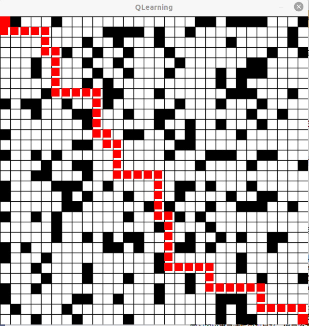
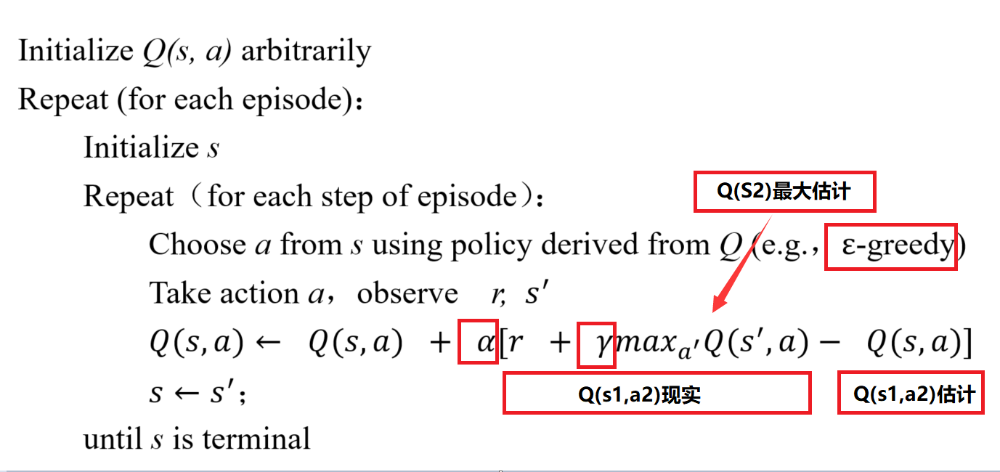

# QLearningVisualization
使用opencv展示QLearning算法全局规划


## 依赖
--opencv4.7.0
```shell
安装参照 https://blog.csdn.net/weixin_43863869/article/details/128552342
```
## 编译运行
```shell
git clone git@github.com:dongtaihong/QLearningVisualization.git
cd QLearningVisualization
mkdir build && cd build
cmake .. && make
./Qlearning
```
## 效果
**说明**：在Qlearning.cpp的GridMap函数中采用的随机方法生成了障碍物，因此很可能会生成无解的地图，所以如果运行程序看到地图无解时请重新运行一下程序。  



## 原理
**本质**: 环境是一个(MDP)马尔科夫决策过程(S, A, P, R, γ)，在最初的环境中，智能体并不知道当前状态下各种动作行为的价值，因此基于价值的强化学习算法通过制定对应的环境评价体系(路径规划中走到终点会获得很大的reward、撞到障碍物会获得很大的惩罚、同时为了获得更短的路径每走一步都会有对应的惩罚)，在环境评价体系建立完成之后，智能体需要不断在环境中训练迭代(价值迭代的原理产生于动态规划-贝尔曼最优方程)，使得该MDP过程逐渐收敛，表现为Q-table逐渐收敛，Q-table收敛之后，环境随之确定(MDP过程的状态-价值转移关系确定)，因此路径规划行为就变成了随着状态不断查Q-table的查表过程。  
**扩展**：Q-learning通过贝尔曼最优方程严谨的通过迭代找到环境的价值Q-table，这个其实是data-based的过程--大量的数据不断更新Q-table，但是Q-table是离散性质的，因此既然都是data-based的过程，很自然的可以想到用深度神经网络来直接拟合Q-function，这就是DQN，DQN的引入使得强化学习的应用灵活性更加良好，但是原本数学意义严谨的贝尔曼动态规划过程此时也因其替代为了深度神经网络而变得不再白盒，导致了可解释性的下降。
